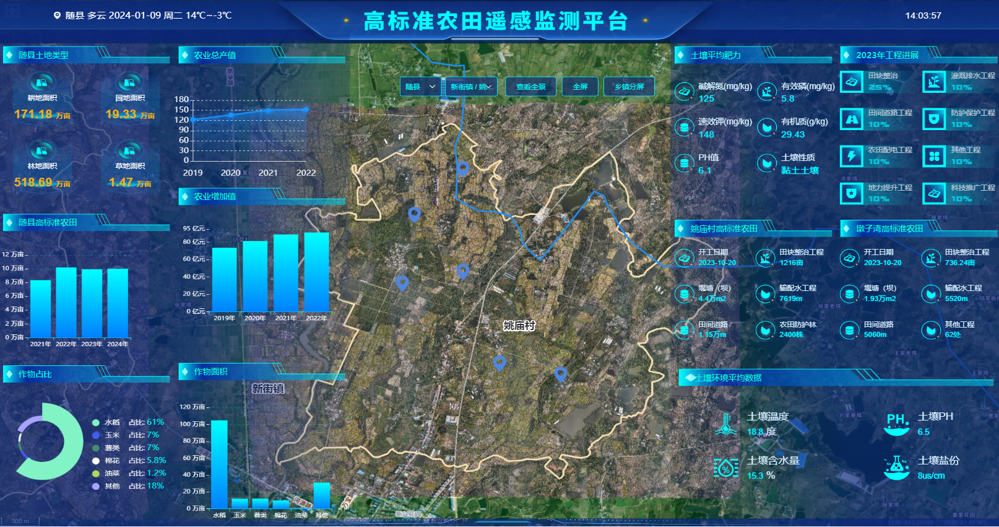

# 高标准农田-智慧农业-遥感监测-AI识别-地物分类

#### 介绍
高标准农田监管平台遥感监测AI识别地物分类，数据大屏、领导驾驶舱

WeChat: 2609375767
#### 软件架构
软件架构说明

前端：vue/leaflet

后台：spring-boot

APP：原生安卓

#### 系统截图
1. 登录页

2.AI遥感解译结果

3. 领导驾驶舱

4. 全景图   

5. 卷帘效果

6. 项目材料清单

